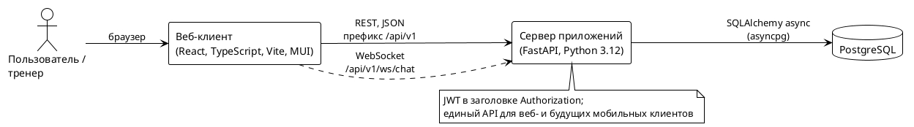
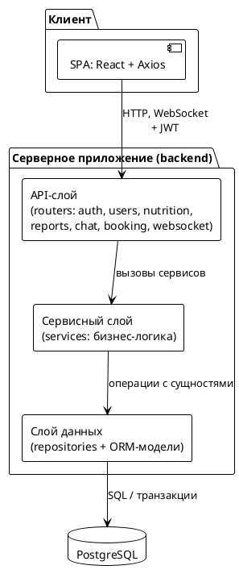
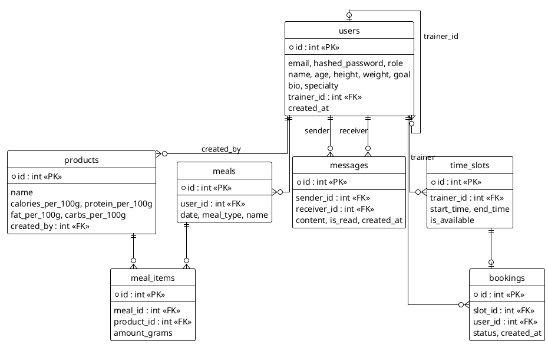
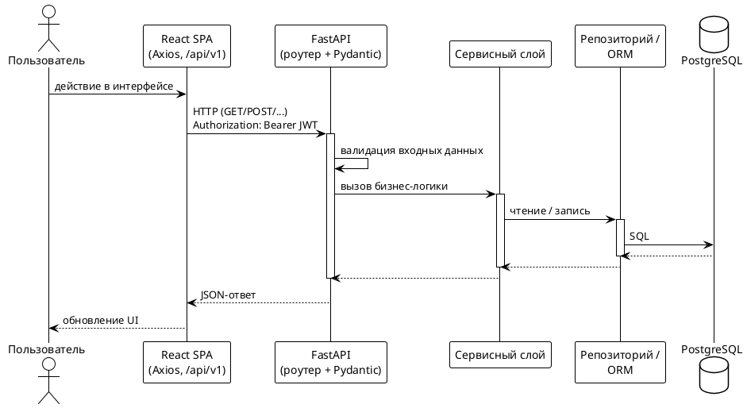
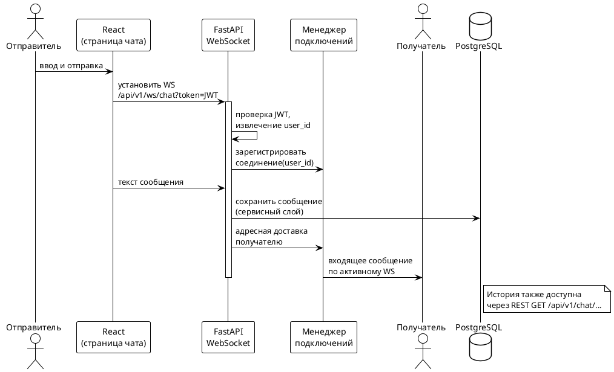
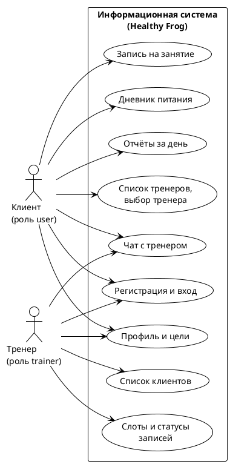
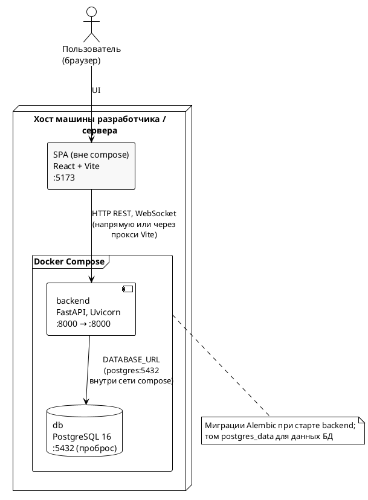

**Введение**

В современных условиях цифровизации и роста интереса к здоровому образу жизни возрастает потребность в инструментах, обеспечивающих системный контроль питания и взаимодействие пользователей с профессиональными тренерами. Несмотря на наличие множества программных решений для учета питания и фитнес-сопровождения, существующие системы, как правило, реализуют лишь отдельные аспекты данного процесса и не обеспечивают комплексной автоматизации взаимодействия между пользователями и специалистами.

Анализ существующих приложений для контроля питания показывает, что большинство из них ориентированы преимущественно на ведение дневника питания и расчет калорийности рациона. При этом функции взаимодействия с тренерами либо отсутствуют, либо реализованы в ограниченном виде и не интегрированы с данными о питании пользователя. В результате пользователи вынуждены использовать несколько разрозненных инструментов, что снижает удобство работы с системой, затрудняет анализ данных и негативно влияет на регулярность ведения учета.

Кроме того, в существующих подходах отсутствуют механизмы централизованного хранения и обработки информации о питании, взаимодействии с тренером и планировании тренировок в рамках единой информационной системы. Это приводит к усложнению процессов сопровождения пользователей и снижает эффективность контроля со стороны тренеров.

Таким образом, возникает задача разработки информационной системы, обеспечивающей автоматизацию учета питания пользователей, формирование отчетности и организацию взаимодействия между пользователями и тренерами в рамках единой программной платформы.

Целью данной выпускной квалификационной работы является разработка программных компонентов информационной системы умного дневника питания с поддержкой социального взаимодействия между пользователями и тренерами.

Для достижения поставленной цели необходимо решить следующие задачи:  
– провести анализ предметной области и существующих решений для учета питания и фитнес-сопровождения;  
– сформировать функциональные и нефункциональные требования к разрабатываемой системе;  
– спроектировать архитектуру информационной системы, включая системную, программную и архитектуру данных;  
– разработать структуру базы данных;  
– реализовать серверную часть системы и API для взаимодействия с клиентскими приложениями;  
– разработать клиентскую часть веб-приложения;  
– реализовать основные функциональные модули системы;  
– провести тестирование разработанных компонентов;  
– продемонстрировать работу системы на тестовых данных.

Объектом исследования является процесс учета питания пользователей и взаимодействия с тренерами в рамках фитнес-сопровождения.

Предметом исследования являются методы и средства проектирования и разработки информационных систем клиент-серверной архитектуры.

Практическая значимость работы заключается в создании прототипа программной системы, обеспечивающей автоматизацию учета питания и взаимодействия пользователей с тренерами, а также возможности дальнейшего расширения функциональности и интеграции с мобильными клиентами.

**1.1 Анализ существующих решений для учёта питания и фитнес-сопровождения**

В настоящее время существует значительное количество программных решений, предназначенных для учета питания и сопровождения пользователей в рамках фитнес-программ. К наиболее распространённым относятся мобильные и веб-приложения, ориентированные на ведение дневника питания, расчет калорийности рациона и отслеживание физической активности.

Среди популярных решений можно выделить MyFitnessPal, Yazio и FatSecret. Указанные системы предоставляют пользователю возможность фиксировать приемы пищи, рассчитывать калорийность и макронутриенты, а также формировать базовую статистику по рациону.

Основные функциональные возможности существующих решений включают:  
– ведение дневника питания с фиксацией приемов пищи;  
– автоматический расчет калорийности и состава продуктов;  
– формирование отчетов по потреблению калорий и макронутриентов;  
– использование встроенных баз данных продуктов питания;  
– интеграцию с фитнес-трекерами и сторонними сервисами.

Несмотря на широкий набор функций, данные системы обладают рядом ограничений с точки зрения комплексной автоматизации процесса фитнес-сопровождения. В большинстве случаев приложения ориентированы исключительно на индивидуальное использование и не обеспечивают полноценного взаимодействия пользователя с тренером в рамках единой платформы.

Анализ показал следующие недостатки существующих решений:  
– отсутствие или ограниченная реализация функций взаимодействия с тренером;  
– разрозненность данных о питании и коммуникации (использование сторонних мессенджеров);  
– отсутствие механизмов централизованного контроля и анализа данных со стороны тренера;  
– недостаточная поддержка пользовательских сценариев, связанных с планированием тренировок;  
– ограниченные возможности по организации совместной работы пользователей и тренеров;  
– недостаточная гибкость в расширении функциональности в рамках единой системы.

Кроме того, существующие решения, как правило, не учитывают необходимость интеграции различных аспектов сопровождения пользователя (учёт питания, коммуникация, планирование занятий) в рамках единой информационной системы, что снижает эффективность их использования в условиях регулярного взаимодействия с тренером.

Таким образом, проведённый анализ показывает, что при наличии большого количества приложений для учета питания отсутствуют решения, обеспечивающие комплексную автоматизацию процессов учета питания и взаимодействия пользователей с тренерами в рамках единой программной платформы.

**1.2 Анализ требований к системам контроля питания**

Системы контроля питания относятся к классу информационных систем, ориентированных на обработку пользовательских данных, связанных с рационом, физическим состоянием и целями пользователя. Основной задачей таких систем является автоматизация процессов учета питания, анализа данных и предоставления пользователю и специалистам инструментов для принятия решений.

Анализ существующих решений и предметной области позволяет выделить ключевые требования, предъявляемые к системам данного класса.

**Функциональные требования**

К основным функциональным требованиям систем контроля питания относятся:

– обеспечение возможности регистрации и аутентификации пользователей с последующим управлением персональными данными;  
– ведение дневника питания с возможностью фиксации приемов пищи и состава блюд;  
– автоматический расчет калорийности и макронутриентов на основе введённых данных;  
– формирование отчетности по рациону питания за выбранный период времени;  
– предоставление доступа к данным пользователя со стороны тренера или другого специалиста;  
– обеспечение обмена сообщениями между пользователем и тренером;  
– поддержка планирования тренировок и записи пользователей на занятия;  
– предоставление статистики и динамики изменений показателей пользователя.

Отдельное внимание уделяется поддержке различных пользовательских сценариев, включая как индивидуальное использование системы, так и взаимодействие с тренером.

**Нефункциональные требования**

Нефункциональные требования определяют качественные характеристики системы и включают:

– удобство пользовательского интерфейса и доступность системы для пользователей с различным уровнем подготовки;  
– обеспечение безопасности и конфиденциальности персональных данных пользователей;  
– масштабируемость системы с возможностью увеличения числа пользователей и расширения функциональности;  
– производительность системы при обработке пользовательских запросов;  
– отказоустойчивость и устойчивость к ошибкам;  
– возможность интеграции с внешними сервисами (например, фитнес-трекерами);  
– кроссплатформенность, обеспечивающая работу системы на различных устройствах.

**Анализ недостатков существующих подходов**

Несмотря на наличие указанных требований, анализ существующих систем показывает, что не все из них реализуются в полной мере. Наиболее значимыми проблемами являются:

– отсутствие комплексного подхода к объединению учета питания, коммуникации и планирования тренировок;  
– недостаточная поддержка взаимодействия между пользователями и тренерами;  
– ограниченные возможности для централизованного анализа данных;  
– сложность интеграции различных функциональных модулей в рамках одной системы;  
– отсутствие гибкой архитектуры, позволяющей расширять функциональность системы.

**Выводы по разделу**

Таким образом, системы контроля питания должны обеспечивать не только учет и анализ данных о рационе пользователя, но и поддержку взаимодействия с тренером, а также возможность расширения функциональности в рамках единой архитектуры.

Выявленные требования и недостатки существующих решений служат основой для формирования требований к разрабатываемой информационной системе, представленных в следующем разделе.

**1.3 Формирование требований к разрабатываемой информационной системе**

На основании анализа предметной области и существующих решений, представленного в предыдущих разделах, были сформированы требования к разрабатываемой информационной системе умного дневника питания с поддержкой взаимодействия пользователей и тренеров.

Формирование требований осуществлялось с учётом:  
– результатов анализа существующих решений;  
– выявленных недостатков систем контроля питания;  
– особенностей прикладного процесса учета питания и взаимодействия с тренером;  
– целей и задач выпускной квалификационной работы.

**Функциональные требования**

Функциональные требования определяют перечень возможностей, реализуемых системой.

| **ID** | **Требование** | **Источник** |
| --- | --- | --- |
| FR-1 | Система должна обеспечивать регистрацию и аутентификацию пользователей | Базовый сценарий использования системы |
| FR-2 | Система должна обеспечивать хранение и редактирование персональных данных пользователя (возраст, рост, вес, цели) | Анализ предметной области |
| FR-3 | Система должна обеспечивать ведение дневника питания с фиксацией приёмов пищи | Анализ существующих решений |
| FR-4 | Система должна обеспечивать добавление продуктов в приёмы пищи с указанием их состава | Анализ предметной области |
| FR-5 | Система должна автоматически рассчитывать калорийность и макронутриенты | Анализ существующих решений |
| FR-6 | Система должна формировать отчёты по питанию за выбранный период | Анализ требований к системам контроля питания |
| FR-7 | Система должна предоставлять тренеру доступ к данным закреплённых пользователей | Анализ прикладного процесса |
| FR-8 | Система должна обеспечивать обмен сообщениями между пользователем и тренером | Постановка задачи ВКР |
| FR-9 | Система должна поддерживать планирование занятий с тренером | Анализ предметной области |
| FR-10 | Система должна обеспечивать запись пользователя на занятия через интерфейс системы | Постановка задачи ВКР |
| FR-11 | Система должна отображать список тренеров и их профили | Анализ предметной области |
| FR-12 | Система должна предоставлять пользователю статистику и динамику показателей | Анализ требований |
| FR-13 | Система должна поддерживать роли пользователей (пользователь, тренер) | Архитектурные требования |
| FR-14 | Система должна обеспечивать хранение истории взаимодействия (питание, сообщения, записи) | Анализ предметной области |

**Нефункциональные требования**

Нефункциональные требования определяют качественные характеристики системы.

| **ID** | **Требование** | **Источник** |
| --- | --- | --- |
| NFR-1 | Система должна обеспечивать удобный и интуитивно понятный пользовательский интерфейс | Требования к UX |
| NFR-2 | Система должна обеспечивать безопасность хранения и передачи данных | Общие требования к информационным системам |
| NFR-3 | Система должна поддерживать аутентификацию на основе токенов (JWT) | Архитектурные решения |
| NFR-4 | Система должна обеспечивать масштабируемость и возможность расширения функциональности | Требования к развитию системы |
| NFR-5 | Система должна обеспечивать работу в клиент-серверной архитектуре | Постановка задачи ВКР |
| NFR-6 | Система должна обеспечивать доступ к функциональности через REST API | Архитектурные требования |
| NFR-7 | Система должна поддерживать обработку запросов в реальном времени для чата | Анализ прикладного процесса |
| NFR-8 | Система должна обеспечивать хранение данных в реляционной базе данных | Технические ограничения |
| NFR-9 | Система должна обеспечивать кроссплатформенность клиентской части | Требования к системе |
| NFR-10 | Система должна обеспечивать устойчивость к ошибкам и корректную обработку исключений | Общие требования к ПО |

**Выводы по разделу**

Таким образом, сформированные функциональные и нефункциональные требования определяют состав и характеристики разрабатываемой информационной системы.

Полученный набор требований отражает необходимость реализации системы, обеспечивающей не только учет питания, но и поддержку взаимодействия пользователей и тренеров, а также возможность дальнейшего расширения функциональности.

Сформированные требования используются в качестве основы для проектирования архитектуры системы, структуры базы данных и интерфейсов взаимодействия компонентов, рассматриваемых в следующей главе.

**2.1 Архитектура программной платформы**

Разрабатываемая информационная система реализуется в виде клиент-серверного приложения, обеспечивающего взаимодействие пользователей и тренеров через единый программный интерфейс.

**Общая архитектура системы**

В основе системы лежит клиент-серверная архитектура, предполагающая разделение системы на следующие основные компоненты:

– клиентское приложение (веб-интерфейс);  
– сервер приложений (backend);  
– система управления базами данных.

Клиентское приложение отвечает за взаимодействие с пользователем, визуализацию данных и отправку запросов к серверу. Сервер приложений реализует бизнес-логику системы, обрабатывает запросы клиентов и обеспечивает взаимодействие с базой данных. СУБД предназначена для хранения пользовательских данных, информации о питании, сообщениях и записях на занятия.

Взаимодействие между клиентом и сервером осуществляется по протоколу HTTP с использованием REST API. Для обеспечения обмена сообщениями в режиме реального времени используется протокол WebSocket.

*Рисунок 1 — Общая архитектура системы (клиент — сервер приложений — СУБД). Исходный текст диаграммы приведён ниже; его можно открыть в PlantUML (расширение IDE, plantuml.com, плагин для Word) и сохранить изображение для вставки в документ.*

**Архитектура серверной части**

Серверная часть системы реализована на основе многослойной архитектуры с разделением ответственности между компонентами. Основные уровни архитектуры включают:

**API-слой**

API-слой реализован с использованием фреймворка FastAPI и выполняет следующие функции:  
– обработка входящих HTTP-запросов;  
– маршрутизация запросов к соответствующим обработчикам;  
– валидация входных данных с использованием Pydantic-схем;  
– обеспечение механизмов аутентификации и авторизации.

API-слой предоставляет единый интерфейс взаимодействия для клиентских приложений.

**Сервисный слой**

Сервисный слой содержит бизнес-логику системы и выполняет:  
– обработку пользовательских сценариев;  
– координацию работы с данными;  
– реализацию правил обработки информации (например, расчет калорийности, обработка сообщений, управление записями на занятия).

Сервисный слой обеспечивает независимость бизнес-логики от конкретных способов хранения данных и взаимодействия с внешними компонентами.

**Слой доступа к данным**

Слой доступа к данным реализован с использованием библиотеки SQLAlchemy и обеспечивает:  
– выполнение операций чтения и записи данных в базу данных;  
– инкапсуляцию SQL-запросов;  
– работу с объектной моделью данных.

Данный слой реализует паттерн Repository, что позволяет изолировать логику работы с базой данных от бизнес-логики.

*Рисунок 2 — Многослойная архитектура серверной части (соответствует структуре проекта: модули api → services → repositories).*

**Архитектура клиентской части**

Клиентская часть реализована в виде одностраничного веб-приложения (SPA) с использованием библиотеки React и языка TypeScript.

Основные функции клиентской части:  
– отображение пользовательского интерфейса;  
– управление состоянием приложения;  
– взаимодействие с серверной частью через REST API;  
– обработка пользовательских действий;  
– подключение к WebSocket для получения сообщений в реальном времени.

Архитектура клиентского приложения основана на компонентном подходе, что обеспечивает переиспользуемость элементов интерфейса и упрощает сопровождение кода.

**Механизмы аутентификации и авторизации**

Для обеспечения безопасности системы используется механизм аутентификации на основе JSON Web Token (JWT). Пользователь проходит процедуру входа в систему, после чего получает токен, который используется для авторизации всех последующих запросов к API.

Передача токена осуществляется в заголовке Authorization, что обеспечивает независимость клиентских приложений и позволяет использовать единый механизм авторизации для веб- и мобильных клиентов.

**Поддержка взаимодействия в реальном времени**

Для реализации обмена сообщениями между пользователями и тренерами используется технология WebSocket. Это позволяет обеспечить двустороннюю связь между клиентом и сервером без необходимости постоянного опроса API.

На сервере реализован механизм управления подключениями, обеспечивающий доставку сообщений соответствующим пользователям.

**Масштабируемость и расширяемость системы**

Разрабатываемая архитектура ориентирована на дальнейшее развитие системы и поддерживает:  
– возможность подключения мобильных клиентов (Android, iOS) без изменения серверной части;  
– расширение функциональности за счёт добавления новых модулей;  
– масштабирование серверной части при увеличении нагрузки;  
– интеграцию с внешними сервисами.

Использование многослойной архитектуры и стандартизированных интерфейсов взаимодействия обеспечивает гибкость системы и упрощает её развитие.

**Выводы по разделу**

Таким образом, выбранная архитектура обеспечивает разделение ответственности между компонентами системы, поддержку взаимодействия в реальном времени и возможность дальнейшего масштабирования и расширения функциональности.

Данная архитектура является основой для проектирования структуры базы данных и интерфейсов взаимодействия компонентов системы, рассматриваемых в следующих разделах.

**2.2 Проектирование структуры базы данных**

Структура базы данных разрабатываемой информационной системы предназначена для хранения данных о пользователях, их рационе питания, взаимодействии с тренерами и записи на занятия.

В качестве системы управления базами данных выбрана PostgreSQL, обеспечивающая надёжное хранение данных, поддержку транзакций и возможность масштабирования.

**Основные сущности системы**

В процессе проектирования были выделены следующие основные сущности:

– пользователь (User);  
– профиль пользователя и тренера;  
– продукт питания (Product);  
– приём пищи (Meal);  
– элементы приёма пищи (MealItem);  
– сообщение (Message);  
– временные слоты тренера (TrainerSlot);  
– запись на занятие (Booking).

Каждая из сущностей отражает отдельный аспект прикладного процесса.

**Описание сущностей**

**Пользователь**

Сущность User предназначена для хранения информации о пользователях системы.

Основные атрибуты:  
– уникальный идентификатор;  
– имя;  
– адрес электронной почты;  
– пароль (в зашифрованном виде);  
– роль пользователя (пользователь или тренер);  
– дата регистрации.

Система поддерживает разграничение ролей, что позволяет реализовать различные сценарии взаимодействия.

**Профиль пользователя**

Дополнительная информация о пользователе хранится в отдельной сущности UserProfile.

Атрибуты:  
– возраст;  
– рост;  
– вес;  
– цель (например, снижение веса, набор массы).

Это позволяет отделить учетные данные от предметной информации.

**Продукт питания**

Сущность Product содержит информацию о продуктах питания.

Атрибуты:  
– название продукта;  
– калорийность;  
– содержание белков, жиров и углеводов.

Данная сущность используется при формировании приёмов пищи.

**Приём пищи**

Сущность Meal отражает факт приема пищи пользователем.

Атрибуты:  
– дата и время;  
– тип приёма пищи (завтрак, обед, ужин, перекус);  
– ссылка на пользователя.

**Элемент приёма пищи**

Сущность MealItem реализует связь между приёмом пищи и продуктами.

Атрибуты:  
– ссылка на приём пищи;  
– ссылка на продукт;  
– количество (в граммах).

Такая структура позволяет учитывать состав каждого приема пищи.

**Сообщения**

Сущность Message предназначена для хранения переписки между пользователями и тренерами.

Атрибуты:  
– отправитель;  
– получатель;  
– текст сообщения;  
– дата и время отправки;  
– статус прочтения.

**Слоты тренера**

Сущность TrainerSlot описывает доступные временные интервалы для проведения занятий.

Атрибуты:  
– тренер;  
– дата и время начала;  
– дата и время окончания;  
– доступность.

**Запись на занятие**

Сущность Booking предназначена для хранения информации о записи пользователя на занятие.

Атрибуты:  
– пользователь;  
– тренер;  
– временной слот;  
– статус записи (запланировано, подтверждено, отменено).

**Связи между сущностями**

В рамках проектирования базы данных были определены следующие связи:

– один пользователь может иметь несколько приёмов пищи (связь один-ко-многим);  
– один приём пищи может содержать несколько продуктов (через сущность MealItem);  
– один тренер может быть связан с несколькими пользователями;  
– пользователи и тренеры могут обмениваться сообщениями (двусторонняя связь);  
– один тренер может иметь множество временных слотов;  
– один пользователь может иметь несколько записей на занятия.

Такая структура обеспечивает гибкость хранения данных и поддержку основных сценариев системы.

*Рисунок 3 — Логическая схема данных (основные таблицы и связи в реализованной БД). В коде проекта поля профиля пользователя и тренера хранятся в одной таблице users (отдельная сущность UserProfile в тексте выше отражает логическое разделение учётных и предметных данных). Слоты занятий соответствуют таблице time_slots.*

**Обоснование выбранной структуры**

Выбранная структура базы данных обеспечивает:  
– нормализацию данных и устранение избыточности;  
– возможность расширения системы за счёт добавления новых сущностей;  
– поддержку основных пользовательских сценариев;  
– удобство выполнения аналитических запросов (например, расчет дневной калорийности).

Разделение сущностей (например, Meal и MealItem) позволяет эффективно моделировать составные объекты и упрощает обработку данных.

**Выводы по разделу**

Таким образом, разработанная структура базы данных отражает ключевые объекты предметной области и обеспечивает хранение информации, необходимой для реализации функциональности системы.

Полученная модель данных служит основой для реализации серверной части системы и проектирования интерфейсов взаимодействия компонентов, рассматриваемых в следующем разделе.

**2.3 Проектирование REST API и взаимодействия компонентов системы**

Для обеспечения взаимодействия между компонентами системы используется архитектурный подход, основанный на REST API. Серверная часть системы предоставляет набор HTTP-интерфейсов, обеспечивающих доступ к функциональности приложения со стороны клиентских приложений.

**Общие принципы проектирования API**

При разработке REST API использовались следующие принципы:

– использование стандартных HTTP-методов (GET, POST, PUT, PATCH, DELETE);  
– разделение API на логические группы (аутентификация, пользователи, питание, чат, записи);  
– передача данных в формате JSON;  
– использование единого префикса для всех эндпоинтов (/api/v1);  
– обеспечение единообразной структуры запросов и ответов;  
– обработка ошибок с использованием стандартных HTTP-кодов.

API проектируется с учётом возможности использования различными клиентами, включая веб-приложение и потенциальные мобильные приложения.

**Основные группы эндпоинтов**

В рамках системы выделены следующие группы эндпоинтов.

**Аутентификация**

Данная группа обеспечивает регистрацию пользователей и получение токена доступа.

Основные эндпоинты:  
– POST /api/v1/auth/register — регистрация пользователя;  
– POST /api/v1/auth/login — аутентификация и получение JWT-токена.

**Пользователи и тренеры**

Эндпоинты данной группы обеспечивают управление профилями пользователей и взаимодействие с тренерами.

Примеры:  
– GET /api/v1/users/me — получение данных текущего пользователя;  
– PUT /api/v1/users/me — обновление профиля;  
– GET /api/v1/users/trainers — получение списка тренеров;  
– POST /api/v1/users/me/trainer/{id} — назначение тренера пользователю;  
– GET /api/v1/users/my-clients — получение списка клиентов тренера.

**Дневник питания**

Данная группа реализует учет питания пользователя.

Основные эндпоинты:  
– GET /api/v1/nutrition/products — получение списка продуктов;  
– POST /api/v1/nutrition/products — добавление нового продукта;  
– GET /api/v1/nutrition/meals — получение списка приемов пищи за день;  
– POST /api/v1/nutrition/meals — создание приема пищи;  
– POST /api/v1/nutrition/meals/{id}/items — добавление продукта в прием пищи.

**Отчёты**

Эндпоинты предназначены для формирования аналитической информации.

– GET /api/v1/reports/daily — получение сводного отчета за день (калории и макронутриенты).

**Чат**

Для взаимодействия пользователя и тренера реализованы два механизма: REST и WebSocket.

REST:  
– GET /api/v1/chat/{user_id} — получение истории сообщений;  
– POST /api/v1/chat — отправка сообщения.

WebSocket:  
– /api/v1/ws/chat — двустороннее соединение для обмена сообщениями в реальном времени.

**Запись на занятия**

Эндпоинты данной группы обеспечивают планирование тренировок.

– GET /api/v1/bookings/slots/{trainer_id} — получение доступных слотов;  
– POST /api/v1/bookings/slots — создание слота тренером;  
– POST /api/v1/bookings — запись пользователя на занятие;  
– GET /api/v1/bookings/my — получение списка записей пользователя;  
– PATCH /api/v1/bookings/{id}/status — изменение статуса записи.

**Взаимодействие компонентов системы**

Взаимодействие компонентов системы организовано следующим образом:

1.  Пользователь выполняет действие в клиентском приложении (например, добавляет приём пищи).
2.  Клиентское приложение формирует HTTP-запрос и отправляет его на сервер.
3.  API-слой принимает запрос, выполняет валидацию и передает управление в сервисный слой.
4.  Сервисный слой обрабатывает бизнес-логику и обращается к слою доступа к данным.
5.  Слой доступа к данным выполняет операции с базой данных.
6.  Результат возвращается обратно через API-слой клиенту.

*Рисунок 4 — Диаграмма последовательности обработки типового REST-запроса (например, создание приёма пищи или получение отчёта).*

Для операций, требующих взаимодействия в реальном времени (например, чат), используется WebSocket-соединение, позволяющее передавать сообщения без повторных HTTP-запросов.

*Рисунок 5 — Упрощённая диаграмма последовательности обмена сообщениями в чате (WebSocket + сохранение в БД; токен передаётся при установлении соединения, как в реализации `/api/v1/ws/chat`).*

**Обеспечение безопасности взаимодействия**

Для защиты API используется механизм аутентификации на основе JWT. Все защищённые эндпоинты требуют передачи токена в заголовке Authorization.

Дополнительно реализуется:  
– проверка прав доступа в зависимости от роли пользователя;  
– валидация входных данных;  
– обработка ошибок и исключений.

**Выводы по разделу**

Таким образом, разработанный REST API обеспечивает доступ ко всем функциям системы и реализует взаимодействие между клиентской и серверной частями.

Использование стандартизированного подхода к проектированию API и поддержка WebSocket позволяют обеспечить гибкость системы, её расширяемость и поддержку различных клиентских приложений.

**2.4 Проектирование пользовательских сценариев**

Проектирование пользовательских сценариев необходимо для формализации способов взаимодействия пользователей и тренеров с разрабатываемой системой. Сценарии позволяют определить последовательность действий участников, выявить необходимые функции системы и уточнить требования к интерфейсам и серверной логике.

В разрабатываемой системе выделяются две основные роли: пользователь и тренер. Пользователь ведёт дневник питания, отслеживает показатели, взаимодействует с тренером и записывается на занятия. Тренер анализирует данные закреплённых пользователей, консультирует их и управляет доступными временными слотами для записи.

*Рисунок 6 — Диаграмма прецедентов (основные функции по ролям; пересечения отражают общие сценарии — например, чат и работа с записями).*

**Основные пользовательские сценарии**

**Сценарий 1. Регистрация и вход в систему**

Данный сценарий является базовым и обеспечивает доступ пользователя к функциональности системы.

Последовательность действий:  
– пользователь открывает веб-приложение;  
– переходит на страницу регистрации или входа;  
– вводит учётные данные;  
– система выполняет проверку корректности введённых данных;  
– при успешной аутентификации пользователь получает доступ к личному кабинету.

Результат сценария: пользователь авторизован в системе и может использовать доступные ему функции.

**Сценарий 2. Заполнение и редактирование профиля**

После регистрации пользователь заполняет персональные данные, необходимые для дальнейшего использования системы.

Последовательность действий:  
– пользователь открывает раздел профиля;  
– вводит или изменяет сведения о возрасте, росте, весе и цели;  
– система сохраняет введённые данные;  
– обновлённая информация становится доступной для последующего анализа.

Результат сценария: в системе сформирован профиль пользователя с параметрами, необходимыми для сопровождения.

**Сценарий 3. Ведение дневника питания**

Данный сценарий является одним из ключевых для системы.

Последовательность действий:  
– пользователь выбирает дату и тип приёма пищи;  
– создаёт запись о приёме пищи;  
– добавляет продукты с указанием количества;  
– система рассчитывает калорийность и макронутриенты;  
– данные сохраняются в базе данных;  
– пользователь получает обновлённую сводную информацию за день.

Результат сценария: в системе сохранены данные о рационе пользователя, доступные для просмотра и анализа.

**Сценарий 4. Просмотр дневного отчёта**

Сценарий предназначен для анализа текущего состояния рациона.

Последовательность действий:  
– пользователь открывает раздел отчётов;  
– выбирает интересующую дату;  
– система выполняет агрегацию данных по всем приёмам пищи за день;  
– пользователю отображается суммарная информация по калориям, белкам, жирам и углеводам.

Результат сценария: пользователь получает сводный отчёт по рациону за выбранный день.

**Сценарий 5. Выбор тренера**

Для организации сопровождения пользователь может выбрать тренера из списка доступных специалистов.

Последовательность действий:  
– пользователь переходит в раздел со списком тренеров;  
– просматривает профили тренеров;  
– выбирает подходящего тренера;  
– система сохраняет связь между пользователем и тренером.

Результат сценария: за пользователем закреплён тренер.

**Сценарий 6. Обмен сообщениями между пользователем и тренером**

Сценарий обеспечивает взаимодействие в рамках сопровождения.

Последовательность действий:  
– пользователь или тренер открывает чат;  
– выбирает диалог;  
– вводит сообщение;  
– сообщение отправляется на сервер;  
– сервер сохраняет сообщение в базе данных;  
– при активном соединении сообщение доставляется получателю в режиме реального времени.

Результат сценария: сообщение сохранено и доставлено получателю.

**Сценарий 7. Создание слотов тренером**

Сценарий предназначен для планирования занятий.

Последовательность действий:  
– тренер открывает раздел управления слотами;  
– задаёт дату и время доступного интервала;  
– система сохраняет слот как доступный для записи.

Результат сценария: в системе появляется новый временной слот, доступный пользователям.

**Сценарий 8. Запись пользователя на занятие**

Сценарий реализует планирование взаимодействия между пользователем и тренером.

Последовательность действий:  
– пользователь открывает список доступных слотов тренера;  
– выбирает подходящий временной интервал;  
– отправляет запрос на запись;  
– система создаёт запись на занятие;  
– тренер получает информацию о новой записи.

Результат сценария: пользователь записан на занятие, а информация о записи сохранена в системе.

**Значение пользовательских сценариев для проектирования**

Выделенные сценарии используются для:  
– уточнения состава функциональных требований;  
– проектирования структуры интерфейсов;  
– определения набора API-эндпоинтов;  
– проектирования логики взаимодействия между клиентской и серверной частями;  
– подготовки тестовых сценариев для проверки работоспособности системы.

**Выводы по разделу**

Таким образом, проектирование пользовательских сценариев позволило формализовать основные способы взаимодействия с системой со стороны пользователей и тренеров.

Полученные сценарии служат основой для реализации клиентской и серверной частей системы, а также для последующего тестирования ключевых функций приложения.

**3.1 Реализация серверной части системы**

Серверная часть разрабатываемой информационной системы реализована с использованием языка программирования Python и фреймворка FastAPI. Сервер выполняет ключевую роль в обработке запросов, реализации бизнес-логики и взаимодействии с базой данных.

**Общая структура серверного приложения**

Серверная часть построена на основе многослойной архитектуры с разделением ответственности между компонентами. Структура проекта организована по модульному принципу и включает следующие основные элементы:

– модуль API (обработчики HTTP-запросов);  
– сервисный слой (реализация бизнес-логики);  
– слой доступа к данным (работа с базой данных);  
– модели данных (ORM-модели);  
– схемы данных (Pydantic-модели);  
– модуль конфигурации и инициализации приложения.

Такая структура обеспечивает удобство сопровождения, расширения и тестирования системы.

**Реализация API-слоя**

API-слой реализован с использованием FastAPI и предназначен для обработки входящих запросов от клиентских приложений.

Основные функции API-слоя:  
– маршрутизация HTTP-запросов;  
– валидация входных данных с использованием Pydantic;  
– преобразование данных между внешними и внутренними представлениями;  
– обработка ошибок и формирование ответов.

Эндпоинты сгруппированы по функциональным модулям:  
– аутентификация;  
– пользователи;  
– питание;  
– чат;  
– записи на занятия;  
– отчёты.

Такое разделение упрощает навигацию по коду и развитие системы.

**Реализация сервисного слоя**

Сервисный слой реализует бизнес-логику системы и обеспечивает обработку пользовательских сценариев.

В рамках системы реализованы следующие основные сервисы:  
– сервис управления пользователями;  
– сервис работы с дневником питания;  
– сервис формирования отчётов;  
– сервис обмена сообщениями;  
– сервис управления записями на занятия.

Сервисный слой выполняет:  
– обработку данных, полученных от API-слоя;  
– реализацию логики (например, расчёт калорийности);  
– взаимодействие с репозиториями;  
– контроль корректности операций.

**Реализация слоя доступа к данным**

Слой доступа к данным реализован с использованием библиотеки SQLAlchemy и паттерна Repository.

Основные функции:  
– выполнение операций чтения и записи в базу данных;  
– изоляция логики работы с данными;  
– предоставление интерфейсов для сервисного слоя.

Использование данного подхода позволяет:  
– упростить тестирование бизнес-логики;  
– обеспечить независимость сервисного слоя от конкретной реализации СУБД;  
– повысить читаемость и структурированность кода.

**Реализация аутентификации и авторизации**

Для обеспечения безопасности системы реализован механизм аутентификации на основе JSON Web Token (JWT).

Процесс аутентификации включает:  
– проверку учетных данных пользователя;  
– генерацию токена доступа;  
– передачу токена клиенту.

При выполнении защищённых запросов клиент передает токен в заголовке Authorization. Сервер выполняет проверку токена и определяет права доступа пользователя.

Реализовано разграничение прав в зависимости от роли пользователя (пользователь или тренер), что позволяет ограничить доступ к отдельным функциям системы.

**Реализация обмена сообщениями**

Для реализации чата между пользователями и тренерами используются два механизма:

– REST API — для получения истории сообщений и отправки сообщений при отсутствии активного соединения;  
– WebSocket — для обмена сообщениями в режиме реального времени.

На сервере реализован механизм управления подключениями, позволяющий:  
– отслеживать активные соединения пользователей;  
– направлять сообщения соответствующим получателям;  
– обеспечивать двустороннюю коммуникацию без повторных HTTP-запросов.

**Работа с базой данных**

Взаимодействие с базой данных осуществляется через SQLAlchemy ORM. Для управления структурой базы данных используется инструмент Alembic, обеспечивающий выполнение миграций.

Основные операции включают:  
– создание, изменение и удаление записей;  
– выборку данных по заданным условиям;  
– выполнение агрегирующих запросов для формирования отчётов.

Использование миграций позволяет контролировать изменения структуры базы данных и упрощает развертывание системы.

**Развертывание серверной части**

Серверная часть системы разворачивается с использованием контейнеризации (Docker). В составе системы выделяются следующие компоненты:

– контейнер с серверным приложением;  
– контейнер с базой данных PostgreSQL.

Использование Docker обеспечивает:  
– изоляцию компонентов системы;  
– воспроизводимость окружения;  
– упрощение развертывания и тестирования.

*Рисунок 7 — Схема развёртывания: контейнеры `backend` и `db` (docker-compose); клиентская SPA в типовом сценарии разработки запускается на хосте (Vite, порт 5173) и обращается к API на порту 8000.*

**Выводы по разделу**

Таким образом, серверная часть системы реализована с использованием современных технологий и архитектурных подходов, обеспечивающих разделение ответственности, безопасность и возможность масштабирования.

Реализованная структура приложения и набор функциональных модулей позволяют обеспечить выполнение основных пользовательских сценариев и служат основой для дальнейшего развития системы.

**3.2 Реализация клиентской части веб-приложения**

Клиентская часть разрабатываемой информационной системы реализована в виде одностраничного веб-приложения (Single Page Application, SPA) с использованием библиотеки React и языка TypeScript.

Основной задачей клиентского приложения является обеспечение взаимодействия пользователя с системой, визуализация данных и отправка запросов к серверной части через REST API.

**Общая структура клиентского приложения**

Клиентское приложение построено по модульному принципу и включает следующие основные компоненты:

– страницы приложения (pages);  
– переиспользуемые компоненты интерфейса (components);  
– модуль взаимодействия с API (api);  
– контекст управления состоянием (context);  
– типы данных (types).

Такое разделение позволяет обеспечить структурированность кода и упрощает сопровождение приложения.

**Реализация маршрутизации**

Для организации навигации между страницами используется библиотека React Router. Приложение включает следующие основные маршруты:

– страница авторизации;  
– главная страница (Dashboard);  
– страница профиля пользователя;  
– страница дневника питания;  
– страница списка тренеров;  
– страница чата;  
– страница записи на занятия.

Маршрутизация реализована с учётом разграничения доступа, что позволяет ограничивать доступ к функциональности неавторизованных пользователей.

**Управление состоянием приложения**

Для управления состоянием приложения используется контекст React (AuthContext), который хранит:

– информацию о текущем пользователе;  
– JWT-токен;  
– состояние авторизации.

Это позволяет централизованно управлять доступом к защищённым ресурсам и обеспечивать передачу токена при выполнении запросов к серверу.

Локальное состояние компонентов (например, формы или списки данных) управляется с использованием стандартных механизмов React (useState, useEffect).

**Взаимодействие с серверной частью**

Взаимодействие с сервером осуществляется через REST API с использованием HTTP-клиента (Axios).

Клиентская часть реализует:  
– отправку запросов на сервер;  
– обработку ответов;  
– обработку ошибок;  
– передачу токена авторизации в заголовках запросов.

Для удобства взаимодействия с API реализован отдельный модуль, содержащий функции для работы с различными группами эндпоинтов (аутентификация, питание, чат, записи и др.).

**Реализация пользовательского интерфейса**

Интерфейс приложения реализован с использованием библиотеки компонентов Material UI (MUI), обеспечивающей:

– единообразный стиль интерфейса;  
– адаптивность под различные устройства;  
– ускорение разработки за счёт готовых компонентов.

Основные элементы интерфейса:  
– формы ввода данных;  
– списки и таблицы;  
– карточки с информацией;  
– навигационные элементы;  
– элементы визуализации данных (например, прогресс потребления калорий).

Интерфейс ориентирован на использование на мобильных устройствах, что достигается за счёт ограничения ширины контента и адаптивной верстки.

**Реализация ключевых страниц**

**Страница авторизации**

Обеспечивает ввод логина и пароля пользователя, отправку запроса на сервер и получение токена доступа.

**Главная страница (Dashboard)**

Отображает основную информацию о пользователе, включая:  
– суммарную калорийность за день;  
– показатели макронутриентов;  
– список приёмов пищи.

**Страница дневника питания**

Позволяет:  
– создавать приёмы пищи;  
– добавлять продукты;  
– просматривать данные за выбранную дату.

**Страница тренеров**

Отображает список доступных тренеров и позволяет выбрать тренера для взаимодействия.

**Страница чата**

Реализует обмен сообщениями между пользователем и тренером с использованием REST API и WebSocket.

**Страница записи на занятия**

Позволяет просматривать доступные временные слоты и записываться на занятия.

**Поддержка взаимодействия в реальном времени**

Для реализации чата используется WebSocket-соединение, позволяющее получать сообщения без необходимости постоянного обновления страницы.

Клиентское приложение устанавливает соединение с сервером и обрабатывает входящие сообщения, обновляя интерфейс в режиме реального времени.

**Выводы по разделу**

Таким образом, клиентская часть системы реализована с использованием современных технологий веб-разработки и обеспечивает удобное взаимодействие пользователя с системой.

Использование компонентного подхода, централизованного управления состоянием и стандартизированных механизмов взаимодействия с сервером позволяет обеспечить гибкость, расширяемость и удобство сопровождения приложения.

**3.3 Реализация основных функциональных модулей**

В рамках разработки информационной системы были реализованы основные функциональные модули, обеспечивающие выполнение ключевых пользовательских сценариев. Каждый модуль отвечает за отдельную часть функциональности системы и реализован с использованием серверной и клиентской частей приложения.

**Модуль аутентификации и управления пользователями**

Данный модуль обеспечивает регистрацию, аутентификацию и управление данными пользователей.

Основные функции:  
– регистрация новых пользователей;  
– аутентификация с использованием логина и пароля;  
– генерация и проверка JWT-токенов;  
– хранение и редактирование данных профиля;  
– разграничение прав доступа на основе ролей (пользователь, тренер).

Модуль реализован на серверной стороне с использованием механизмов FastAPI и интегрирован с клиентской частью через REST API.

**Модуль дневника питания**

Модуль дневника питания является центральным компонентом системы и обеспечивает учет рациона пользователя.

Основные функции:  
– создание записей о приёмах пищи;  
– добавление продуктов в состав приёма пищи;  
– хранение данных о количестве и составе продуктов;  
– автоматический расчет калорийности и макронутриентов;  
– отображение данных в удобном виде на клиентской стороне.

Расчёт показателей осуществляется на сервере, что обеспечивает единообразие результатов и упрощает обработку данных.

**Модуль формирования отчётов**

Модуль предназначен для анализа данных о питании пользователя.

Основные функции:  
– агрегация данных о приёмах пищи за выбранный период;  
– расчет суммарной калорийности;  
– расчет содержания белков, жиров и углеводов;  
– предоставление пользователю сводной информации.

Модуль реализован в виде серверных эндпоинтов и используется клиентским приложением для отображения аналитических данных.

**Модуль взаимодействия пользователей и тренеров**

Данный модуль обеспечивает связь между пользователями и тренерами.

Основные функции:  
– отображение списка тренеров;  
– выбор тренера пользователем;  
– закрепление тренера за пользователем;  
– предоставление тренеру доступа к данным пользователя.

Модуль реализует логику взаимодействия и обеспечивает поддержку сценариев сопровождения пользователя.

**Модуль обмена сообщениями (чат)**

Модуль чата реализует коммуникацию между пользователями и тренерами.

Основные функции:  
– отправка сообщений;  
– получение истории сообщений;  
– хранение сообщений в базе данных;  
– доставка сообщений в режиме реального времени.

Реализация модуля включает:  
– REST API для работы с историей сообщений;  
– WebSocket-соединение для обмена сообщениями в реальном времени.

Использование WebSocket позволяет снизить нагрузку на сервер и обеспечить мгновенную доставку сообщений.

**Модуль планирования и записи на занятия**

Модуль обеспечивает организацию взаимодействия пользователя и тренера в рамках тренировочного процесса.

Основные функции:  
– создание тренером временных слотов;  
– отображение доступных слотов пользователю;  
– запись пользователя на занятие;  
– управление статусом записи.

Модуль реализует полный цикл взаимодействия от планирования до подтверждения записи.

**Взаимодействие модулей**

Все модули системы интегрированы между собой и работают в рамках единой архитектуры.

Например:  
– данные дневника питания используются в модуле отчетов;  
– информация о пользователе используется в модуле взаимодействия с тренером;  
– чат используется для обсуждения результатов и планирования занятий.

Такое взаимодействие обеспечивает целостность системы и поддержку комплексных пользовательских сценариев.

**Выводы по разделу**

Таким образом, в рамках разработки были реализованы основные функциональные модули, обеспечивающие выполнение ключевых задач системы.

Разделение системы на модули позволило упростить разработку, повысить читаемость кода и обеспечить возможность дальнейшего расширения функциональности.

**3.4 Тестирование и демонстрация работы системы**

Для подтверждения работоспособности разработанной информационной системы было проведено тестирование основных функциональных компонентов и пользовательских сценариев.

Целью тестирования являлась проверка корректности работы системы, соответствия реализованной функциональности сформированным требованиям, а также выявление возможных ошибок.

**Подход к тестированию**

В рамках работы использовались следующие методы тестирования:

– модульное тестирование отдельных компонентов серверной части;  
– интеграционное тестирование REST API;  
– ручное тестирование пользовательских сценариев;  
– проверка взаимодействия компонентов системы.

Основное внимание уделялось тестированию ключевых функций системы.

**Тестирование серверной части**

Тестирование серверной части проводилось с использованием инструментов для отправки HTTP-запросов (например, Swagger UI и API-клиенты).

Проверялись следующие аспекты:

– корректность обработки запросов к API;  
– соответствие формата ответов ожидаемым структурам;  
– обработка некорректных входных данных;  
– работа механизма аутентификации;  
– разграничение прав доступа.

Особое внимание уделялось проверке:  
– операций создания и получения данных;  
– корректности расчетов (например, калорийности);  
– устойчивости системы к ошибкам.

**Тестирование клиентской части**

Тестирование клиентского приложения проводилось вручную и включало:

– проверку корректности отображения интерфейса;  
– тестирование навигации между страницами;  
– проверку работы форм ввода данных;  
– проверку взаимодействия с серверной частью.

Дополнительно проверялась адаптивность интерфейса при использовании на устройствах с различными размерами экрана.

**Тестирование пользовательских сценариев**

Для проверки корректности работы системы были протестированы основные пользовательские сценарии:

– регистрация и вход в систему;  
– заполнение и редактирование профиля;  
– создание и редактирование приёмов пищи;  
– добавление продуктов и расчет показателей;  
– просмотр отчетов по питанию;  
– выбор тренера;  
– обмен сообщениями в чате;  
– создание слотов и запись на занятия.

В ходе тестирования подтверждена корректность выполнения указанных сценариев.

**Тестирование взаимодействия в реальном времени**

Отдельное внимание уделялось проверке работы WebSocket-соединения.

Проверялись:  
– установление соединения между клиентом и сервером;  
– отправка сообщений;  
– получение сообщений в режиме реального времени;  
– корректная обработка разрыва соединения.

Результаты тестирования показали, что сообщения доставляются корректно и без значительных задержек.

**Демонстрация работы системы**

Для демонстрации работы системы использовались тестовые данные, позволяющие воспроизвести основные сценарии использования.

Демонстрация включает:  
– авторизацию пользователя;  
– работу с дневником питания;  
– просмотр отчетов;  
– взаимодействие с тренером через чат;  
– запись на занятие.

Использование тестовых данных позволяет наглядно продемонстрировать функциональность системы без необходимости использования реальных пользовательских данных.

**Выводы по разделу**

Проведённое тестирование показало, что разработанная система корректно реализует основные функциональные возможности и обеспечивает выполнение ключевых пользовательских сценариев.

Система демонстрирует устойчивую работу, корректную обработку данных и возможность дальнейшего развития.